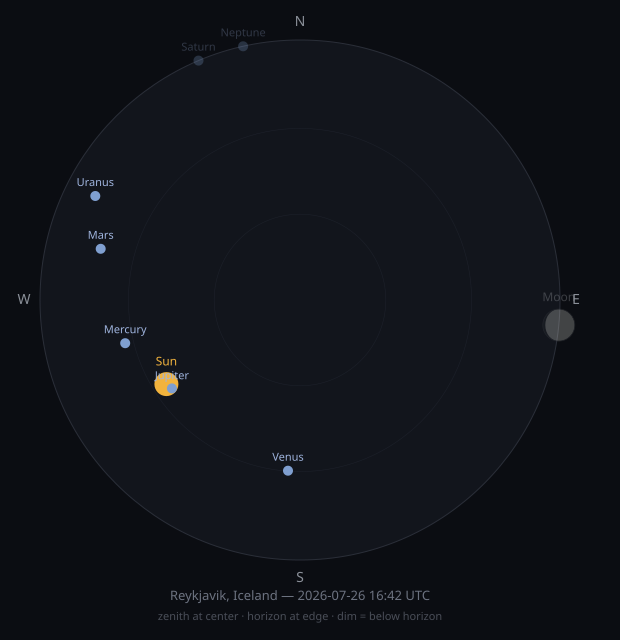
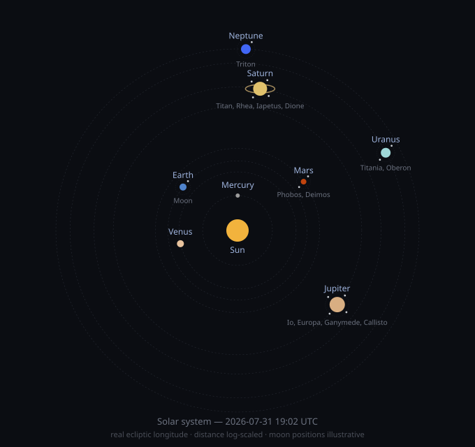

# living-sky

A repo that renders tonight's sky and commits it to itself, once an hour, forever.

A GitHub Actions workflow rotates through a list of saved locations, computes the
current positions of the sun, moon (shaded to its real phase), and visible planets
using [`astronomy-engine`](https://github.com/cosinekitty/astronomy), renders a
polar sky-dome SVG, and pushes it straight back into this README. The commit
history is a timelapse of the sky over the year — no server, no database, no
external hosting.

Alongside that, a second view renders the whole solar system from above: the
Sun at the center, all eight planets at their real current ecliptic longitude,
Saturn's rings, and each planet's major moons.

<!--SKY:START-->


_Currently showing: **Cairo, Egypt** — 2026-08-02 14:20 UTC_
<!--SKY:END-->

## Solar system view (optional)

<!--SOLAR:START-->


_Solar system, viewed from above — **2026-08-02 14:20 UTC**. Planet angles are real (ecliptic longitude); distances are log-scaled so the outer planets stay on the page._
<!--SOLAR:END-->

## How it works

1. `state/rotation.json` tracks which of the `config/locations.json` entries is "current."
2. `scripts/generate.js` computes sky positions for that location and time, renders `sky.svg`, and updates the caption above.
3. `scripts/generate-solar-system.js` computes real planet positions (ecliptic longitude, log-scaled distance) and renders `solar-system.svg`. Distances are log-scaled so Neptune doesn't crush Mercury into an unreadable cluster near the Sun; moon positions are illustrative, not computed — the names and which planet they orbit are real.
4. `.github/workflows/sky.yml` runs both scripts every hour and commits the results.

## Running locally

```bash
npm install
node scripts/generate.js
node scripts/generate-solar-system.js
```